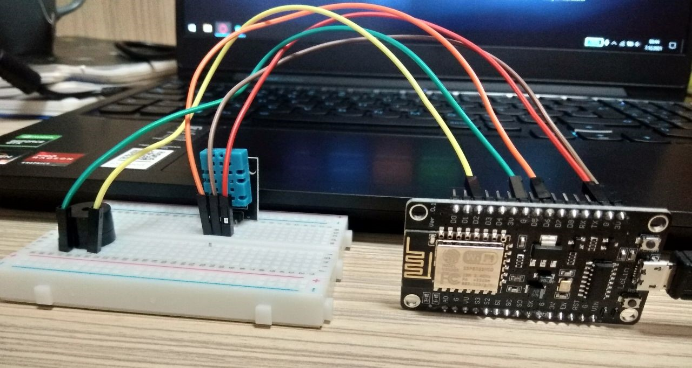

## Temperature and humidity measurement with NodeMCU and DHT11 by sending commands with Telegram Bot. Alarm alert with buzzer.

### 🌡️ If the temperature is above 25 and the humidity is above 50, the Buzzer works.

